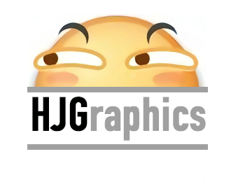
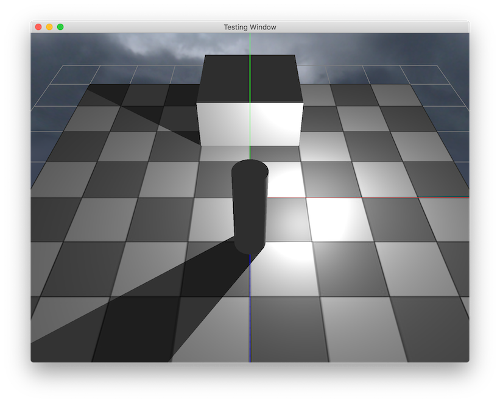
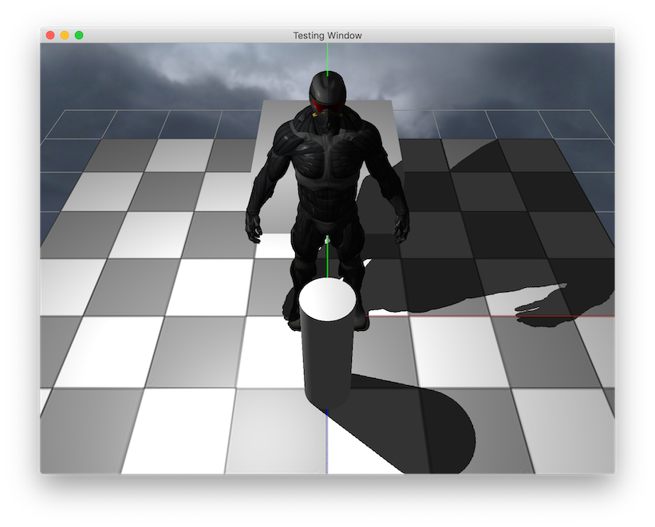
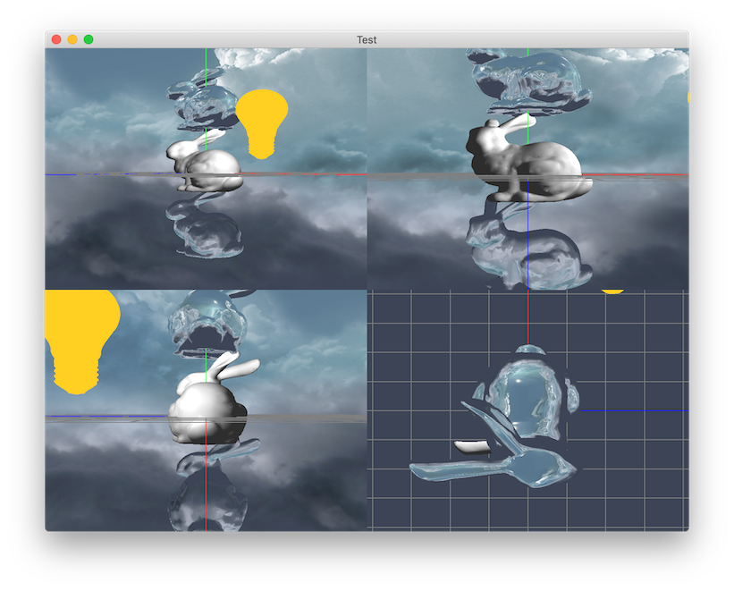

# HJGraphics
HJGraphics is a very simple 3D graphic framework based on OpenGL API, and also my attempt to build a relatively complete tiny 3D graphic framework from the ground up. It is a part of my graduation project as well.

By using HJGraphics, you can create OpenGL environment and draw some funny 3D objects with  a few lines of codes.

eg.
```
Window window(windowWidth,windowHeight,windowTitle);
Box box(boxWidth,boxDepth,boxHeight);
Camera camera(cameraPosition,cameraDirection);
PointLight pointLight(lightPosition);
Scene scene;
scene.addCamera(camera);
scene.addObject(box);
scene.addLight(pointLight);
window.addScene(scene);
window.run();
```

# Features
HJGraphics has...

* Window : a GLFW wrapped window system(now HJGraphics supports Qt, see HJGraphics-Qt).
* Camera 
* Scene : an easy way to manage and draw objects.
* Object : a few build-in 3D objects support include
    * Model 
    * Basic geometries like cylinder, box and plane. 
    * Skybox
    * Coordinate and grid
* Light : build-in basic lights support and unlimited number of lights in a single scene.
    * Point light
    * Parallel light
    * Spot light
    * Shadow for 3 kinds of lights above 
* Material : basic material support like diffuse map, specular map, normal map and height map.

# Gallery


Fig.1 unlimited number of lights support



Fig.2 shadow support



Fig.3 model loading support (only `obj` format fully supported now)



Fig.4 basic material

# Continue advancing
- [ ] SSAO
- [ ] Load scene via JSON file
- [ ] HDR
- [ ] Deferred shading option

# Acknowledge
Amazing tutorials : [learnopengl.com](https://www.learnopengl.com)

OpenGL API reference : [OpenGL wiki](https://www.khronos.org/opengl/wiki/)

Useful book : [OpenGL Programming Guide](https://book.douban.com/subject/26925331/)

